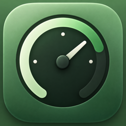

# CodexMeter

CodexMeter 是一个原生 macOS 菜单栏应用和桌面 Widget，用于显示当前 Codex 账号的套餐、额度窗口、重置时间、Credits（存在时）和最后更新时间。

> 非官方社区项目，与 OpenAI 无隶属关系，也未获得 OpenAI 官方背书。Codex 和 OpenAI 是其各自权利人的商标。



- 最低系统：macOS 14 Sonoma
- 技术栈：Swift、SwiftUI、WidgetKit、ServiceManagement
- 第三方依赖：无
- 默认刷新：主应用每 5 分钟；Widget 读取共享缓存，刷新频率由 macOS 决定

## 隐私

CodexMeter reads usage information locally through the installed Codex CLI.  
No account credentials are collected or uploaded.

应用不会读取浏览器 Cookie，不要求 Access Token，不保存认证信息，不使用 Analytics，也不连接任何第三方服务器。账号网络请求由用户已经安装并登录的 Codex CLI 自行完成。详情见 [PRIVACY.md](PRIVACY.md)。

## 功能

- 菜单栏优先显示 Weekly 剩余额度，例如 `Codex 64%`
- 根据 App Server 实际响应动态显示额度窗口
- 剩余量大于 40% 使用系统 Accent Color，20%–40% 使用橙色，低于 20% 使用红色
- 支持 `systemSmall` 和 `systemMedium` Widget
- 刷新失败时保留最近一次成功缓存
- 使用 Apple `SMAppService` 实现登录时启动
- 随附简洁的绿色额度仪表盘 App 图标

## 数据来源

主应用在本机定位 Codex CLI，并启动：

```bash
codex app-server --stdio
```

随后通过换行分隔的 stdio JSON-RPC 调用：

1. `initialize`
2. `initialized`
3. `account/read`
4. `account/rateLimits/read`

实现包含 request id 匹配、超时、RPC error、通知忽略、非 JSON stdout 容错、独立 stderr 日志和子进程退出处理。额度窗口通过 `windowDurationMins` 识别；只有 `usedPercent` 时，剩余额度按 `max(0, 100 - usedPercent)` 计算。

Codex App Server 的集成方式可参阅 [OpenAI 官方文档](https://developers.openai.com/siwc/token-sharing-open-source/codex-app-server)。

## 开始使用

### 前置条件

1. 安装 macOS 14 或更新版本。
2. 安装完整 Xcode 15 或更新版本。
3. 安装 Codex CLI，并先在终端完成登录。

### Xcode 配置

1. 打开 `CodexMeter.xcodeproj`。
2. 在 `CodexMeter` 与 `CodexMeterWidget` 两个 Target 的 **Signing & Capabilities** 中选择同一个 Team。
3. 把两个默认 Bundle Identifier 改成属于你的唯一值，例如：
   - `com.yourname.CodexMeter`
   - `com.yourname.CodexMeter.Widget`
4. 选择 `CodexMeter` Scheme 和 `My Mac`，按 Run。
5. 首次启动后从菜单栏点击 `Refresh Now`。

项目没有保存任何开发者 Team ID。`CODEX_METER_APP_GROUP` 默认使用：

```text
$(DEVELOPMENT_TEAM).codexmeter.shared
```

Xcode 选择 Team 后，主应用与 Widget 会得到同一个 Team-ID 前缀 App Group。若你的付费开发者账号需要使用已注册的 `group.` 标识，请在两个 Target 的 Build Settings 中把 `CODEX_METER_APP_GROUP` 改成同一个值。

应用设置了 `LSUIElement`，不会常驻 Dock；可以从菜单栏的 `Open CodexMeter` 打开主窗口。

### 添加桌面 Widget

1. 先运行 CodexMeter 并成功刷新一次。
2. 在桌面右键，选择“编辑小组件”。
3. 搜索 `CodexMeter` 或 `Codex Usage`。
4. 添加 Small 或 Medium Widget。

如果系统暂时没有列出 Widget，退出并重新运行已签名的主应用，再打开 Widget Gallery。

## 无签名构建检查

```bash
xcodebuild \
  -project CodexMeter.xcodeproj \
  -scheme CodexMeter \
  -configuration Debug \
  -derivedDataPath .build/DerivedData \
  CODE_SIGNING_ALLOWED=NO \
  build
```

实际运行 Widget 与 App Group 时仍需选择开发团队并签名。

## 项目结构

```text
CodexMeter/
├── CodexMeter.xcodeproj
├── CodexMeter/
│   ├── App/                 # App 入口、菜单栏和 Dashboard
│   ├── Assets.xcassets/     # App 图标
│   ├── Components/          # 进度条和套餐 Badge
│   ├── Models/              # 内部数据模型
│   ├── Services/            # CLI、JSON-RPC、App Server、登录启动项
│   └── Stores/              # 运行状态和 App Group 缓存
├── CodexMeterWidget/        # WidgetKit Extension
└── Shared/                  # App 与 Widget 共用格式化逻辑
```

## Troubleshooting

### 找不到 Codex

在 Terminal 运行：

```bash
command -v codex
codex --version
```

确认 Codex 位于常见安装位置或登录 shell 的 `PATH` 中，然后重启 CodexMeter。

### Codex 未登录

在 Terminal 运行 Codex CLI 并完成登录，再回到菜单栏点击 `Refresh Now`。CodexMeter 不接收或保存登录令牌。

### Widget 不刷新

先打开主应用并点击 `Refresh Now`。Widget 读取 App Group 中最近一次成功缓存，不会自行高频启动 CLI。macOS 会自行调度 Widget Timeline，因此更新可能略有延迟。

### App Group 或签名失败

确认主应用和 Widget Extension 使用同一个 Team，并且两者的 `CODEX_METER_APP_GROUP` 完全一致。修改后删除旧 App、执行 Clean Build Folder，再重新运行。

## 已知限制

- Widget 的刷新频率由 macOS 决定，不保证每 5 分钟更新。
- App Server 协议可能随 Codex CLI 更新；实现对当前 schema 和旧单桶 schema 做了兼容，但未来重大变更可能需要更新。
- 主应用需要启动本地 Codex 子进程，因此没有启用 App Sandbox；Widget 仍启用 Sandbox，只读取 App Group 缓存。
- Launch at Login 在应用经过签名并放置于 `/Applications` 时最可靠。

## 参与贡献

欢迎 Issue 和 Pull Request。提交前请阅读 [CONTRIBUTING.md](CONTRIBUTING.md) 和 [SECURITY.md](SECURITY.md)。

## License

[MIT License](LICENSE)
